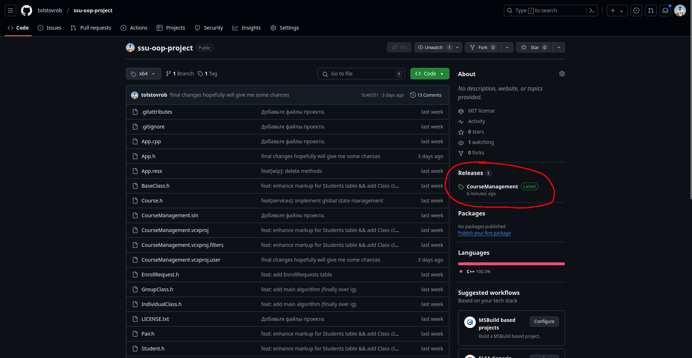
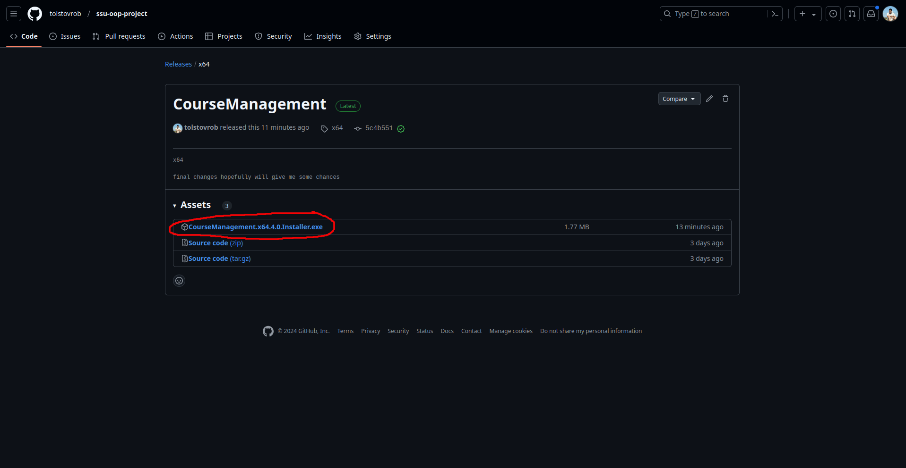

# Управление курсами иностранных языков

## Как установить?

Во вкладке Releases необходимо выбрать CourseManagement

Далее, выбрать `CourseManagement.x64.4.0.Installer.exe`

Затем запустить установщик, выполнить все необходимые шаги.
